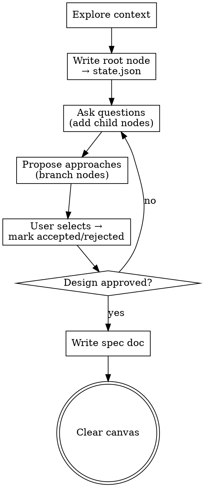

# Visual Brainstorming

Same process as the standard brainstorming skill — explore, question, propose, design, spec — but output is **data-driven**: write structured nodes to `state.canvas.nodes` so the frontend renders them as an interactive mind map.

## Output Format

Every brainstorming artifact must be written as a `CanvasNode` in `state.canvas.nodes`:

```json
{
  "id": "node-1",
  "label": "Short title",
  "status": "active",
  "progress": 0,
  "parentId": null,
  "children": ["node-2", "node-3"],
  "metadata": {}
}
```

### Status values
| Status     | Visual               |
|------------|----------------------|
| `pending`  | Dimmed, neutral      |
| `active`   | Breathing animation  |
| `accepted` | Green highlight      |
| `rejected` | Gray + strikethrough |
| `done`     | Solid checkmark      |

### Data flow
1. You write nodes directly into `state.json` at the workspace root
2. The Vite plugin detects the file change and pushes an HMR update to the frontend
3. The MindMap component re-renders with the new tree
4. User clicks a node → RightSidebar shows properties
5. User sends feedback → `state.feedback[]` updated → you read it next iteration

## Checklist

1. **Explore context** — read project files, understand the domain
2. **Write root node** — set `status: "active"`, `meta.activeSkill: "brainstorming"` in state.json
3. **Branch** — for each idea/approach, add child nodes. Set `status: "pending"` for new branches
4. **Refine** — as the user responds, update node `status`:
   - `accepted` — user approved → green
   - `rejected` — discarded → gray strikethrough
   - `active` — currently discussing → breathing animation
5. **Finalize** — once design is approved, set all accepted nodes to `status: "done"`, write the design doc, set `meta.activeSkill: null` to clear the canvas

## Anti-Patterns

- Do NOT write long prose into `label` — keep it to 3-8 words. Use `metadata.description` for details.
- Do NOT flatten the tree — use `parentId` and `children` to build hierarchy.
- Do NOT render more than ~50 nodes — prune stale branches by setting `status: "rejected"` instead of deleting.
- Do NOT add edges manually — they are derived from `parentId`/`children` automatically.

## Process Flow


