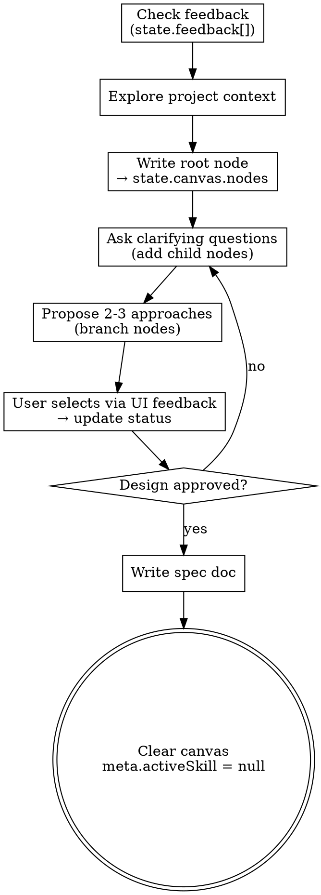

# Visual Brainstorming

Turn ideas into structured, visualized designs. The process is identical to standard brainstorming (explore → question → propose → design → spec), but every artifact is written as tree nodes in `state.canvas.nodes` so the frontend renders an interactive mind map in real time.

<HARD-GATE>
Do NOT invoke any implementation skill, write any code, scaffold any project, or take any implementation action until you have presented a design and the user has approved it through the visual interface. This applies to EVERY project regardless of perceived simplicity.
</HARD-GATE>

## Anti-Pattern: "This Is Too Simple To Need A Design"

Every project goes through this process. A todo list, a single-function utility, a config change — all of them. "Simple" projects are where unexamined assumptions cause the most wasted work. The design can be short, but you MUST present it and get approval.

## How Visual Brainstorming Differs From Standard

| Aspect | Standard | Visual |
|--------|----------|--------|
| Output medium | Terminal chat | `state.canvas.nodes[]` tree JSON |
| User input | Terminal reply | `state.feedback[]` entries |
| State visibility | Implicit in conversation | MindMap renders tree in real time |
| Node lifecycle | Implicit | Explicit `status` field per node |

## Checklist

You MUST complete these items in order:

1. **Process new feedback** — check `state.feedback[]` for unprocessed entries (see Feedback Loop below)
2. **Explore project context** — check files, docs, recent commits
3. **Write root node** — set `meta.activeSkill: "brainstorming"` in state, set root node `status: "active"`
4. **Ask clarifying questions** — one at a time, branching child nodes from the active node
5. **Propose 2-3 approaches** — each as a child branch, with trade-offs and your recommendation
6. **Present design** — in sections, get approval after each section, update node statuses
7. **Write design doc** — save to `docs/superpowers/specs/YYYY-MM-DD-<topic>-design.md`
8. **Clear canvas** — set all accepted nodes to `status: "done"`, set `meta.activeSkill: null`

## Process Flow



**The terminal state is clearing the canvas.** Once the spec is written, do NOT call other implementation skills — hand off by setting `meta.activeSkill: null`, which shows the empty canvas state.

## The Process

### Understanding the idea

- Check the current project state first (files, docs, recent commits)
- Before asking detailed questions, assess scope: if the request describes multiple independent subsystems, flag this immediately. Help the user decompose before diving into details.
- For appropriately-scoped projects, ask questions **one at a time** to refine the idea
- Prefer multiple choice questions when possible
- Only one question per message — if a topic needs more exploration, break it into multiple turns
- Focus on understanding: purpose, constraints, success criteria

### Exploring approaches

- Propose 2-3 different approaches with trade-offs
- Present options conversationally with your recommendation and reasoning
- Lead with your recommended option and explain why

### Presenting the design

- Once you believe you understand what you're building, present the design
- Scale each section to its complexity
- Ask after each section whether it looks right so far
- Cover: architecture, components, data flow, error handling, testing
- Be ready to go back and clarify if something doesn't make sense

### Design for isolation and clarity

- Break the system into smaller units that each have one clear purpose
- For each unit: what does it do, how do you use it, and what does it depend on?
- Smaller, well-bounded units are easier to reason about and test

## Output Format

Every brainstorming node is a `CanvasNode` written to `state.canvas.nodes`:

```json
{
  "id": "node-1",
  "label": "Short title (3-8 words)",
  "status": "active",
  "progress": 0,
  "parentId": null,
  "children": ["node-2", "node-3"],
  "metadata": {
    "description": "Longer explanation goes here",
    "tags": ["scope", "architecture"]
  }
}
```

### Status lifecycle

| Status | When | Visual |
|--------|------|--------|
| `pending` | New branch added, waiting for discussion | Dimmed, neutral |
| `active` | Currently being discussed/brainstormed | Breathing animation |
| `accepted` | User approved the idea | Green highlight |
| `rejected` | User discarded the idea | Gray + strikethrough |
| `done` | Finalized, design approved | Solid checkmark |

### Node rules

- **label**: 3-8 words, short title only. Use `metadata.description` for long text.
- **parentId/children**: Build hierarchy. Every node except root has a parent.
- **Do NOT** add edges manually — hierarchy is derived from parentId/children.
- **Do NOT** delete stale nodes — set `status: "rejected"` instead.
- **Max ~50 nodes** — prune stale branches by rejecting rather than keeping them pending.

## Feedback Loop

The primary user → agent channel during brainstorming is `state.feedback[]`. When users send feedback through the RightSidebar text input, it appends an entry to the array. You MUST check and process these at the start of every turn.

```json
{
  "id": "uuid",
  "nodeId": "node-3",
  "text": "这个方案成本太高了，换一个思路",
  "quickAction": null,
  "createdAt": "2026-05-11T06:16:42.835Z"
}
```

### Required start-of-turn

Before anything else:

1. **Read** `state.feedback[]` — filter for entries where `processedAt === undefined`
2. **Group** by `nodeId` — each group targets a specific node in the tree
3. **Process each group**: switch the agent's focus to that node, address the feedback text
4. **Mark processed**: write `processedAt: new Date().toISOString()` to the feedback entry
5. **Update node status** based on feedback content (accepted ideas → green, rejected → gray, needs discussion → active)

### How user interactions map to feedback

| User action | feedback entry |
|---|---|
| Types text + clicks Send | `{ nodeId: current, text: "..." }` → agent reads and responds |
| Selects a different node | `ui.selectedNodeId` updates (no feedback entry) — purely visual navigation |

The feedback text is the ONLY signal from the UI. There are no quick-action buttons. Every user input comes as text, which you interpret and act on.

## Data Flow

```
1. You write nodes directly into state.canvas.nodes
2. Vite plugin detects file change → pushes HMR to frontend
3. MindMap component re-renders with updated tree
4. User clicks node → sees properties in RightSidebar
5. User types feedback → state.feedback[] updated
6. Next turn: you read feedback, process it, continue
```

## Key Principles

- **One question at a time** — Never overwhelm with multiple questions
- **Multiple choice preferred** — Easier to answer in a text feedback box
- **YAGNI ruthlessly** — Remove unnecessary features from all designs
- **Explore alternatives** — Always propose 2-3 approaches before settling
- **Incremental validation** — Present design, get approval, move on
- **Be flexible** — Go back and clarify when something doesn't make sense

## Spec Self-Review

After writing the spec document, check with fresh eyes:

1. **Placeholder scan:** Any "TBD", "TODO", or vague sections? Fix them.
2. **Internal consistency:** Do sections contradict each other?
3. **Scope check:** Focused enough for a single plan, or needs decomposition?
4. **Ambiguity check:** Can any requirement be interpreted two ways? Pick one.

Fix issues inline. No re-review needed.

## User Review Gate

After the spec is written, ask the user to review it:

> "Spec written and committed to `<path>`. Please review it and let me know if you want changes before I clear the canvas."

Wait for response. If changes requested, edit and re-run self-review. Only proceed once approved.

## Transition

Once the spec is approved:
1. Set all accepted nodes to `status: "done"`
2. Set `meta.activeSkill: null` to clear the canvas
3. The frontend will show the "Select a skill" empty state
