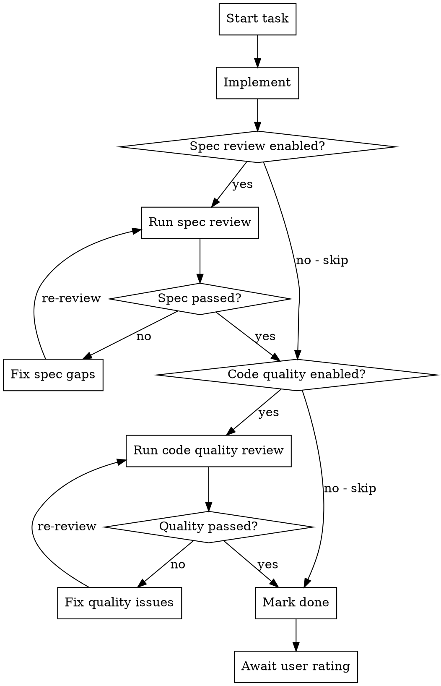

# Visual Executing Plans

Execute implementation plans step by step. The execution canvas is a **left-to-right phase flowchart**: each phase is a region, each region contains ordered subtasks, and each subtask carries its files and quality-gate state.

## Process Overview



## Workflow

### Step 1: Load Plan

Read tasks from `state.canvas.nodes`. If the plan was written by visual-writing-plans, the nodes should already exist with `status: "pending"`, `progress: 0`, and optionally `metadata.qualityGates` configured.

Also maintain **canonical execution layout metadata** in `state.canvas.metadata.executionFlow`.

Required structure:
```json
{
  "orientation": "horizontal",
  "stages": [
    {
      "id": "schema-types",
      "name": "Schema & Types",
      "description": "数据层类型扩展",
      "taskIds": ["task-1", "task-2"]
    }
  ],
  "stageRelations": [
    { "fromStageId": "schema-types", "toStageId": "api-validation", "label": "blocks" }
  ],
  "taskRelations": [
    { "fromTaskId": "task-1", "toTaskId": "task-2", "label": "blocks" }
  ]
}
```

Rules:
- `stages` is the primary layout source for executing-plans
- `taskIds` order defines the visual order of subtasks inside a stage
- the main canvas renders **stage order itself** as the primary phase flow
- `stageRelations` should be omitted unless a future renderer explicitly needs them
- do not emit transitive, redundant, or optional cross-stage relations for the main canvas
- `taskRelations` are optional: use them for within-stage sequencing or explicit local branching
- avoid generic labels like `blocks`; omit labels unless they carry real semantic meaning
- Do **not** rely on `canvas.edges` as the primary layout source for executing-plans

Set the initial state:
```json
{
  "meta": { "activeSkill": "executing-plans", "agentStatus": "idle" },
  "canvas": { "skillType": "executing-plans" }
}
```

### Step 2: Execute Each Task with Quality Gates

For each task, read `node.metadata.qualityGates` to determine which gates are enabled:

| riskLevel | spec-review | code-quality |
|-----------|-------------|--------------|
| `low`     | disabled    | disabled     |
| `medium`  | enabled     | disabled     |
| `high`    | enabled     | enabled      |

Users can override these in the UI. Treat the `qualityGates` array order as the review flow order.

Update state.json at each milestone:

**Starting a task:**
```json
{ "id": "task-2", "status": "active", "progress": 0 }
```
Also set runtime metadata so the UI can show what the agent is doing:
```json
{
  "executionPhase": "implementing",
  "activeFiles": ["packages/schemas/src/planner.ts"],
  "executionEvents": [
    {
      "kind": "phase",
      "message": "Started implementing task-2",
      "timestamp": "2026-05-14T10:00:00.000Z",
      "status": "info",
      "files": ["packages/schemas/src/planner.ts"]
    }
  ]
}
```

**Progress update (during multi-step tasks):**
```json
{ "id": "task-2", "status": "active", "progress": 0.5 }
```
Keep `activeFiles` pointed at the file(s) currently being edited, and append a fresh item to
`executionEvents` whenever the phase changes, a command runs, a review starts, or a fix loop begins.

**Gate review:**
When a gate starts, set the gate state to `running`:
```json
// Via API: PATCH /__state/node/gate-state
{ "nodeId": "task-2", "type": "spec-review", "status": "running" }
```
Also set `executionPhase` to `"reviewing"`:
```json
// Via API: PATCH /__state/node/execution-phase
{ "nodeId": "task-2", "phase": "reviewing" }
```
Also append a review event such as:
```json
{
  "kind": "review",
  "message": "Started spec-review for task-2",
  "timestamp": "2026-05-14T10:04:00.000Z",
  "status": "info"
}
```

When a gate passes:
```json
{ "nodeId": "task-2", "type": "spec-review", "status": "passed", "result": "All requirements met." }
```

When a gate fails:
```json
{ "nodeId": "task-2", "type": "spec-review", "status": "failed", "result": "Missing: email validation. Extra: added admin flag." }
```
Fix the issues, then re-run the gate. Loop until passed.

**Task complete — all gates passed:**
```json
{ "id": "task-2", "status": "done", "progress": 1.0 }
```
Set `executionPhase` to `"idle"`, clear `activeFiles`, and append a success event.

Keep `executionFlow` in sync when you re-plan:
- if a task changes phase, move its `taskId` to the correct stage
- if a stage becomes unnecessary, remove it
- if a new phase relationship appears, add a `stageRelations` entry
- if two tasks inside one stage need explicit order, add a `taskRelations` entry

**Blocked / needs review:**
```json
{ "id": "task-2", "status": "pending", "progress": 0 }
{ "nodeId": "task-2", "text": "Blocked: missing dependency X", "quickAction": null }
```

### Step 3: Verification

After implementation (before gates), run tests specified in the task. If verification fails, set task back to `pending` and add feedback.

### Step 3.5: Await User Rating

After a task is marked `done`, the UI shows star-rating controls (1–5 stars). Ratings are stored in `feedback[].rating`. You do NOT need to prompt for ratings — the UI handles it.

If the user rates 1-2 stars, a **"Re-plan & Re-execute"** button appears. When clicked, the node is reset to `pending` and a feedback entry with `quickAction: "replan"` is added.

### Handling Re-plan Requests

When reading feedback, check for entries with `quickAction: "replan"`:
1. Identify the node referenced by `feedback[].nodeId`
2. Review the user's feedback text and rating context
3. Re-plan the task — break into smaller steps if needed
4. Update `node.metadata.implementationSteps` with the new plan
5. Set `status: "active"`, `progress: 0`, `executionPhase: "implementing"`
6. Execute the re-planned task following the standard gate flow

### Step 4: Complete

Set agent status to idle. Keep `activeSkill` set so the user can review results in the UI:
```json
{ "meta": { "agentStatus": "idle" } }
```
(The user will switch skills explicitly when they're done reviewing.)

## Key Rules

- `activeSkill` stays set after execution completes — users review history in the UI. Only clear when the user explicitly switches skills.
- Status, progress, gateStates, executionPhase, activeFiles, and executionEvents are **Agent-only**. The UI does not allow the user to change them. The user only rates quality.
- `qualityGates` config is set by writing-plans or user via UI
- Do NOT add new tasks — the plan is already defined
- Only one task should be `active` at a time
- Use `meta.agentStatus` to signal state: `"writing"` when executing, `"idle"` when waiting, `"error"` when blocked
- Add feedback entries when blocked or when user input is needed
- Gate re-review loops: when a gate fails, fix and re-run. Do NOT skip to next gate without re-running.

## Checklist

1. **Load plan** — read from `state.canvas.nodes`, check `qualityGates` config, and ensure `canvas.metadata.executionFlow` is present
2. **Set activeSkill** — `meta.activeSkill: "executing-plans"`
3. **Execute each task** — update status + progress at each milestone
4. **Run enabled gates** — spec review first, then code quality (if enabled)
5. **Handle re-plan** — check for `quickAction: "replan"` in feedback
6. **On complete** — `meta.agentStatus: "idle"`, keep `activeSkill` for history review
